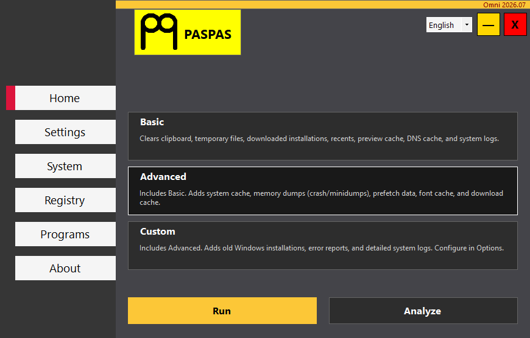
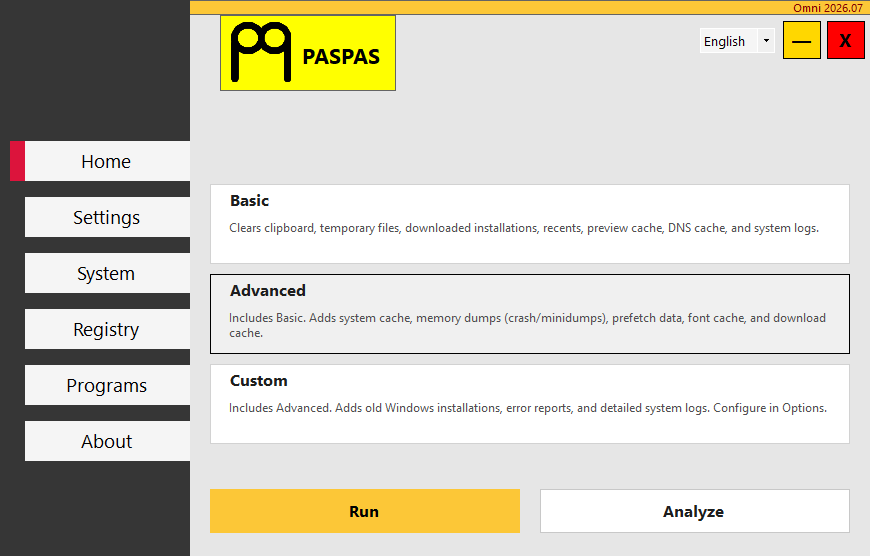

<p align="center">
  
</p>

# PASPAS

All-in-one system utility to clean temporary files, review registry entries, uninstall programs, and tweak Windows performance.

## Features

- **System Cleanup:** Scans and deletes temporary files, system logs, memory dumps, and prefetch data. Includes Basic, Advanced, and Custom modes.
- **Registry Scanner:** Scans 9 specific registry categories for orphaned entries and invalid file paths. You stay in control: scan first, review manually, and delete only what you choose. It safely excludes critical OS files and hardware vendor entries (Microsoft, Windows, Intel, NVIDIA, Realtek, etc.) to protect system stability and help clear forensically sensitive data.
- **Program Uninstaller:** Quickly detects installed software (32-bit and 64-bit) and allows batch uninstallation.
- **System Tweaks:** Applies registry and service modifications to enhance privacy and performance:
  - Disable Windows telemetry and Defender sample submission.
  - Clear user activity history.
  - Set unnecessary background services to manual startup.
- **Multitasking:** Built on .NET 10 with direct system calls and minimal dependencies. Tasks run in the background, allowing you to clean, review the registry, apply tweaks, and uninstall programs simultaneously without freezing the UI.

## Installation

Download the latest release from one of the following sources:

- **GitHub Releases:** [Download](https://github.com/berkaygediz/PASPAS)
- **Microsoft Store:**
<a href="https://apps.microsoft.com/detail/9pbvt4sppm8d?referrer=appbadge&mode=full" target="_blank"  rel="noopener noreferrer">
	
</a>

### Package Managers

You can also install PASPAS using your preferred package manager:

**Winget:**

```bash
winget install -e --id berkaygediz.PASPAS
```

**Chocolatey:**

```bash
choco install paspas
```

## Screenshots

<p align="center">
<table>
  <tr>
    <td></td>
    <td></td>
  </tr>
</table>
</p>

## Requirements

- Windows 10 (17763+) or Windows 11
- Administrator privileges

## Build

Clone the repository and run using .NET 10 SDK:

```bash
git clone https://github.com/berkaygediz/PASPAS.git
cd PASPAS
dotnet run -c Release
```

To publish a single-file executable:

```bash
dotnet publish PASPAS.csproj -c Release -r win-x64 -p:PublishSingleFile=true -p:SelfContained=true -p:PublishTrimmed=false
```

## Notes

PASPAS has been in development for quite some time. The initial source code was created back in 2017, going through many phases and complete rewrites. The project officially became open-source starting June 22, 2023 ([first commit](https://github.com/berkaygediz/PASPAS/commit/5f5ee834c56785c14f1c48e663b4118f6d3f8f1a)). If you are looking for older versions, historical source codes, or just want to say hi, feel free to reach out.

## Press

- [Comment Ça Marche](https://www.commentcamarche.net/telecharger/utilitaires/29641-paspas-un-nettoyeur-de-pc-gratuit-et-sans-installation/) (Téo Marciano - 01/12/23 19:53)
- [JustGeek](https://www.justgeek.fr/paspas-logiciel-nettoyage-pc-simple-et-gratuit-111141/) (Benjamin - 11.08.2023)
- [Softpedia](https://www.softpedia.com/get/Tweak/System-Tweak/PASPAS.shtml) (Robert Condorache ⭐ 4.0 / Users ⭐ 4.7)
- [Softaro](https://softaro.jp/paspas/) (2025/02/28 09:28)
- [PlanetaSofta](https://planetasofta.ru/windows/system-tweak/paspas)
- [AlternativeTo](https://alternativeto.net/software/berkaygediz-paspas/about/) (Users ⭐ 5.0)
- [YouTube - Actualia tech](https://www.youtube.com/watch?v=Il3TOGORYoM) (24.08.2023)

## License

Licensed under the Apache License, 2.0. See the [LICENSE](LICENSE) file.
